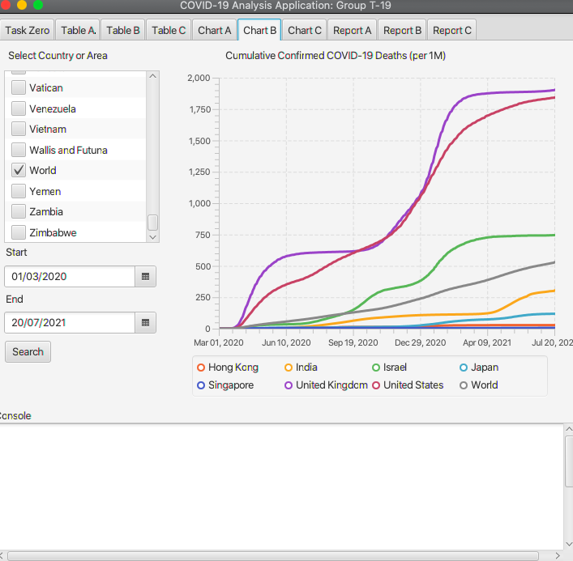

# Software-engineering-covid-project
Software Engineering project for covid data analysis &amp; visualization, coded in Java/JUnit/Jacoco
# 3111h-19-covid

COMP3111H Project 2021F - Team 19

> https://github.com/jchow-ust/3111h-19-covid/tree/master

1. CHOW Hau Cheung Jasper
> email: hcjchow | github: jchow-ust | dev branch: hcjchow_dev
> 
> Task B1 & Task B2 & Task B3
# Task B
## B1

## B2

## B3

Supplementary notes, problem statement and solution statement for B3:

https://github.com/jchow-ust/3111h-19-covid/tree/master/COMP3111H-Task-B3.pdf

2. LIU Kit Chi (Jeff)
> email: kcliuaf | github: liukcj | dev branch: kcliuaf_dev 
> 
> Task A1 & Task A2 & Task A3
# Task A
## A1

## A2

## A3

### Supplementary Notes for A3
#### Problem statement: 

Most of the visualization of data of Covid-19 are in form of graphs. However, the problem with traditional graphs is that they need some knowledge to fully understand the graph, like the line chart. Besides, these traditional ways of representing cases of COVID-19 may not be obvious for demonstration, like the table. Therefore, to make the data more accessible by the public which is important to their health, I decided to propose a more understandable data visualisation tool that can also be easily accessible by the public.

##### Solution:

The graph I have developed is called bubble graph which can show the cases by having different sizes of bubbles. Therefore, the severity of pandemics in different areas can now be easily compared by looking at the size of the bubbles. Also, the graph shows only the top X affected countries which can remind the public that which areas are dangerous. On the other hand, the graph generated can be easily demonstrated to the public because the data is shown graphically.

##### Inplementation details:

The graph is implemented from scratch. The main idea is to use cosine theorem to get the position of the bubble to lie between the other circles.

##### Instructions:

To use the graph, first press the "Load All Country" button (remind that the program need ~50s to load all data). Then input the date you are interested (if the date is too early, a reminder will show in the console) and press the generate button. The graph will be generated (if you are not satisfy with the graph generated, press the generate again and the position of bubbles will be changed).

3. LEUNG Ko Tsun (Kevin)
> email: ktleungai | github: ktleungai | dev branch: ktleungai_dev
>
# Task C1 & Task C2 & Task C3 
## Screenshot of C1:

## Screenshot of C2:

## Task C3:
### Problem Statement of C3: 
Continued from tasks C1 & C2, I find that they are not that user-friendly in terms of visualization and user experience. \
If users want to visualize the vaccination rate differences between all countries on a specific date, users need to select all countries one by one in the selection list view in task C2. \
Also, even if all countries are selected, the generated graph will contain a lot of lines which is difficult to compare the rate between different lines. \
Moreover, if users are interested in the attributes related to COVID-19 of some specific countries, users need to switch between tasks A, B, C to learn about the cases, deaths, and vaccination rates of that country. \
This can be improved by creating a world map visualization by showing different colors on the countries as the intensity indicator. 
### Solution Statement of C3: 
Therefore, to solve the above problems, I created a world map visualization showing different fully vaccinated rates of different countries. \
The world map is easy to use, with clear guidance and concise information. \
There are two major functions of this world map. \
First, users can select different dates to visualize the fully vaccinated rate against COVID-19 as of the selected date. Color scale is shown on the left to tell the corresponding scale of different color intensities. Users can compare the rate between various countries taking reference to the color scale. \
Second, users can click on any country to learn more information about the selected country. The information includes country name, ISO code, population, total vaccination number & rate, fully vaccination number & rate, and new vaccination on that day, total cases number and per 1 million, total deaths number and per 1 million. 
### Implementation details: 
An open-source project called WorldFX is used in this project, which is a JavaFX control of an interactive world map.\
I included their codebase in our project, lying in comp3111.covid.c3worldmap package. \
I have manually changed their codes to suit my need, removed unnecessary classes and functions before adopting them to the project. Link is here: https://github.com/HanSolo/worldfx
Since this is an external package, the unit tests in this repo are not covered for their repo.
## Screenshot of C3: 
## Initialization: 

After selecting a different date(1 May 2021) 

After clicking a country(Canada) 

# Java Doc
[CLICK ME PLEASE :)](./docs/javadoc.md)
# Jacoco report (> 65% Coverage for comp3111.covid)
[CLICK ME PLEASE :)](./docs/jacoco.md)
# Junit report (100% tests passed)
[CLICK ME PLEASE :)](./docs/junit.md)
# Tools used
Controlsfx: https://controlsfx.github.io/
Renjin https://www.renjin.org/resources.html
worldFX: https://github.com/HanSolo/worldfx
